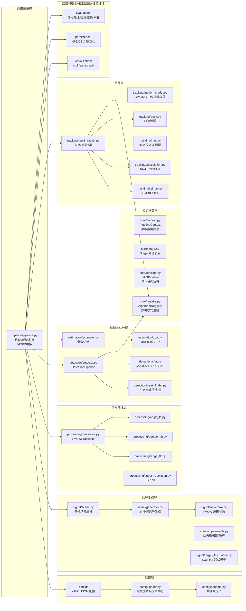

<p align="center">
  <h1 align="center">radarFMCW</h1>
  <p align="center">FMCW 毫米波雷达全流程模块化仿真与信号处理框架</p>
</p>

<p align="center">
  
  
</p>

---

## 项目简介

**radarFMCW** 是一个 **3D FMCW 毫米波雷达全流程模块化仿真与信号处理框架**，它将毫米波雷达的完整信号处理链路——从基带信号仿真到目标检测与跟踪——拆解为独立、可插拔的模块，支持研究人员和工程师快速搭建雷达信号处理流水线、对比不同算法的效果。

### 核心特性

- **全链路仿真**：FMCW 中频信号生成 → 距离/多普勒/角度 FFT 处理 → CFAR 检测 → 参数估计 → 多目标跟踪
- **全流程评估**：信号处理评估（CRLB 对比、RMSE 分析）、目标检测评估（Pd/Pfa/ROC）、目标跟踪评估（GOSPA/CLEAR MOT/HOTA），支持多场景多算法自动对比基准测试
- **多算法对比**：内置 CA/OS/GO/SO 四种 CFAR、KF/EKF/UKF 三种卡尔曼滤波器、NN/GNN/JPDA 三种数据关联算法、FFT/MUSIC/MVDR/ESPRIT 四种 DOA 方法
- **配置驱动**：通过 YAML 配置文件切换雷达参数、检测算法、跟踪策略、可视化后端
- **双可视化后端**：Matplotlib（离线回放/动画）和 PyQtGraph（实时 GPU 加速），统一 3×2 面板布局
- **数据持久化**：支持 NPZ（原始信号）、CSV（检测/跟踪结果）、JSONL（流水线日志）三种格式
- **自定义流水线**：基于 DAG 拓扑排序的通用流水线引擎，支持用户插入自定义处理阶段

---

### 技术栈

| 类别 | 技术 |
|------|------|
| 编程语言 | Python 3.x |
| 数值计算 | NumPy |
| 科学计算 | SciPy（线性代数、信号处理、优化、空间距离） |
| 可视化 | Matplotlib、PyQtGraph（可选） |
| GUI 框架 | PyQt5 / PySide6（可选，pyqtgraph 依赖） |
| 配置解析 | PyYAML |
| 数据读取 | pandas（持久化模块加载 CSV 时使用） |
| 测试框架 | pytest |

### 架构概览图



---

## 快速开始

### 安装

```bash
# 克隆仓库
git clone https://github.com/<your-username>/radarFMCW.git
cd radarFMCW

# 安装核心依赖
pip install numpy scipy pyyaml matplotlib

# [可选] 实时可视化
pip install pyqtgraph PyQt5

# [可选] CSV 数据加载
pip install pandas
```

### 运行示例

```bash
# 最简流水线（从 YAML 配置启动）
python examples/01_quickstart.py

# 多目标检测 + EKF 跟踪
python examples/02_multi_target_detection.py

# 实时可视化（需安装 PyQtGraph）
python examples/03_realtime_viz_pyqtgraph.py

# 离线回放可视化
python examples/04_playback_viz_matplotlib.py

# KF vs EKF vs UKF 跟踪对比
python examples/05_tracking_comparison.py

# 四种 CFAR 对比
python examples/06_cfar_comparison.py

# 数据持久化演示
python examples/07_persistence.py

# 自定义 DAG 处理阶段
python examples/08_custom_stage.py
```

### 程序化使用

```python
from fmcw.pipeline import RadarPipeline
from fmcw.config import load_config

# 从配置文件加载
config = load_config("configs/radar_79ghz_mid_range.yaml")
pipe = RadarPipeline(**config)
results = pipe.run()

# 访问结果
print(f"检测目标数: {len(results['estimates'])}")
print(f"跟踪航迹数: {len(results['tracks'])}")
```

---

## 架构概览

```
                    ┌─────────────────────────────┐
                    │      YAML 配置文件            │
                    │  radar / pipeline / scenario   │
                    └──────────────┬──────────────┘
                                   ▼
                    ┌─────────────────────────────┐
                    │     RadarPipeline.run()      │
                    │     全流程编排入口             │
                    └──────┬──────┬──────┬──────┘
                           │      │      │
              ┌────────────┘      │      └────────────┐
              ▼                   ▼                   ▼
   ┌──────────────────┐ ┌──────────────────┐ ┌──────────────────┐
   │   信号生成层       │ │  信号处理层       │ │  检测与估计层     │
   │ Scene → Generator │ │ Range/Doppler/   │ │ CFAR → Peak      │
   │ → IF Signal       │ │ Angle FFT        │ │ Grouping → DOA   │
   └──────────────────┘ └──────────────────┘ └──────────────────┘
                           │
                           ▼
              ┌─────────────────────────────┐
              │       跟踪层                 │
              │  KF/EKF/UKF → Association    │
              │  → Track Management          │
              └──────┬──────────────────────┘
                     │
         ┌───────────┼───────────────┐
         ▼           ▼               ▼
   ┌──────────┐ ┌──────────┐ ┌──────────────┐
   │ 可视化    │ │ 持久化    │ │   评估模块    │
   │ mpl/     │ │ NPZ/CSV/ │ │ Signal/Det/  │
   │ pyqtgraph│ │ JSONL    │ │ Track Eval   │
   └──────────┘ └──────────┘ └──────────────┘
```

---

## 项目结构

```
radarFMCW/
├── fmcw/                          # 核心框架包
│   ├── core/                      # 通用流水线框架
│   │   ├── context.py             # PipelineContext：黑板模式数据共享
│   │   ├── stage.py               # Stage：流水线节点定义
│   │   ├── pipeline.py            # DAGPipeline：拓扑排序流水线引擎
│   │   └── registry.py            # AlgorithmRegistry：算法注册表
│   ├── config/                    # 配置系统
│   │   ├── schema.py              # 10 个数据类定义
│   │   ├── loader.py              # YAML/JSON 反序列化
│   │   └── defaults.yaml          # 默认配置
│   ├── signal/                    # 信号生成与场景建模
│   │   ├── waveform.py            # FMCW 波形参数与物理公式
│   │   ├── generator.py           # IF 中频信号生成引擎
│   │   ├── scene.py               # 多帧场景编排
│   │   ├── target_fluctuation.py  # Swerling 0-4 目标起伏模型
│   │   ├── antenna_pattern.py     # ULA/URA 天线方向图
│   │   └── impairments.py         # IQ 失衡、相位噪声、热噪声
│   ├── processing/                # FFT 信号处理链
│   │   ├── range_fft.py           # 距离维 FFT（实输入半谱）
│   │   ├── doppler_fft.py         # 多普勒维 FFT（fftshift）
│   │   ├── angle_fft.py           # 角度维 FFT（fftshift）
│   │   ├── processor.py           # 三级联 FFT 编排
│   │   └── super_resolution.py    # TLS-ESPRIT + BeamspaceMUSIC
│   ├── detection/                 # 目标检测
│   │   ├── cfar.py                # CA/OS/GO/SO 四种 CFAR
│   │   ├── cfar_alpha.py          # CFAR 门限因子理论计算
│   │   ├── peak_finder.py         # 形态学峰值检测（legacy）
│   │   └── detector.py            # DetectionPipeline
│   ├── estimation/                # 参数估计
│   │   ├── estimator.py           # 距离/速度/角度参数提取
│   │   └── doa.py                 # MUSIC / MVDR 超分辨 DOA
│   ├── tracking/                  # 多目标跟踪
│   │   ├── motion_model.py        # CV/CA/CTRA 运动模型
│   │   ├── kalman.py              # KF/EKF/UKF 三种滤波器
│   │   ├── imm.py                 # IMM 交互多模型
│   │   ├── association.py         # NN/GNN/JPDA 三种关联算法
│   │   ├── track.py               # 航迹生命周期管理
│   │   └── multi_tracker.py       # 多目标跟踪编排器
│   ├── visualization/             # 可视化
│   │   ├── base.py                # 抽象基类
│   │   ├── panels.py              # 共享绘图函数
│   │   ├── factory.py             # 可视化工厂函数
│   │   ├── mpl_viz.py             # Matplotlib 后端
│   │   └── pyqtgraph_viz.py       # PyQtGraph 后端
│   ├── persistence/               # 数据持久化
│   │   ├── log_manager.py         # JSONL 流水线日志
│   │   ├── signal_store.py        # NPZ 信号存储
│   │   ├── csv_manager.py         # CSV 写入器
│   │   └── io_manager.py          # 统一 IO 协调器
│   ├── pipeline/                  # 雷达专用流水线
│   │   └── pipeline.py            # RadarPipeline 全流程编排入口
│   ├── evaluation/                # 全流程评估模块
│   │   ├── models.py              # 评估数据模型（7 个数据类）
│   │   ├── collector.py           # 双模式数据收集器
│   │   ├── adapters.py            # 数据格式适配器
│   │   ├── signal_eval.py         # 信号处理评估 + CRLB
│   │   ├── detection_eval.py      # 目标检测评估（Pd/Pfa/ROC）
│   │   ├── tracking_eval.py       # 目标跟踪评估（GOSPA/MOTA/HOTA）
│   │   ├── manager.py             # 统一编排入口
│   │   ├── streaming.py           # 增量在线评估器
│   │   ├── benchmark.py           # 多场景多算法基准测试
│   │   └── scenarios/             # 8 个标准化测试场景
│   └── utils/                     # 工具函数
│       ├── constants.py           # 物理常数
│       ├── transforms.py          # 坐标变换
│       ├── metrics.py             # 评估指标（RMSE/OSPA/GOSPA）
│       └── window.py              # 窗函数
├── configs/                       # 示例配置文件
│   ├── radar_79ghz_mid_range.yaml # 79GHz 中距雷达
│   ├── radar_77ghz_short_range.yaml # 77GHz 短距雷达
│   └── scenarios/                 # 独立场景配置
├── examples/                      # 示例脚本（14 个）
│   ├── 01_quickstart.py           # 最简流水线
│   ├── 02_multi_target_detection.py
│   ├── 03_realtime_viz_pyqtgraph.py
│   ├── 04_playback_viz_matplotlib.py
│   ├── 05_tracking_comparison.py  # KF/EKF/UKF 对比
│   ├── 06_cfar_comparison.py      # 四种 CFAR 对比
│   ├── 07_persistence.py
│   ├── 08_custom_stage.py         # 自定义 DAG 阶段
│   ├── 09_imm_tracking_demo.py    # IMM 交互多模型示例
│   ├── 09_fmcw_imm_demo.py
│   ├── 09_multi_angle_detection.py
│   ├── 10_eval_basic.py           # 评估模块快速入门
│   ├── 11_eval_signal_processing.py # CRLB + SNR 扫描
│   ├── 12_eval_cfar_comparison.py   # CFAR 检测器对比
│   ├── 13_eval_tracking_comparison.py # 跟踪算法对比
│   └── 14_eval_benchmark.py         # 完整基准测试
├── scripts/
│   └── generate_cfar_lut.py       # CFAR alpha LUT 生成
├── tests/                         # 测试（9 个文件，154+ 测试）
│   ├── test_motion_model.py
│   ├── test_kalman.py
│   ├── test_imm.py
│   ├── test_signal_generator.py
│   ├── test_association.py
│   ├── test_persistence.py
│   ├── test_cfar.py
│   ├── test_processor.py
│   └── test_evaluation.py
├── .gitignore
└── README.md
```

---

## 配置说明

所有 YAML 配置文件遵循三级结构：

```yaml
radar:           # 雷达物理参数
  fc: 79.0e9              # 载频 (Hz)
  B: 0.5e9                # 带宽 (Hz)
  Tc: 40.0e-6             # Chirp 周期 (s)
  chirp_num: 128           # 每帧 Chirp 数
  sample_num: 1024         # 每 Chirp 采样数
  antenna_num: 8           # 天线数

pipeline:        # 流水线算法配置
  detection:
    cfar_algorithm: ca_cfar  # ca_cfar|os_cfar|go_cfar|so_cfar
    pfa: 1.0e-4
  estimation:
    doa_method: fft          # fft|esprit|music|mvdr
  tracking:
    filter: kf               # kf|ekf|ukf
    association: gnn         # nn|gnn|jpda
    enable_imm: false        # 启用 IMM 交互多模型

scenario:        # 仿真场景定义
  num_frames: 50
  frame_interval: 0.05
  snr_db: 25.0
  targets:
    - id: 1
      initial_range: 50.0
      initial_velocity: 10.0
      initial_angle: 20.0
      rcs: 1.0
      motion: constant_velocity
```

---

## 算法清单

| 类别 | 算法 |
|------|------|
| **FFT 处理** | Range FFT、Doppler FFT、Angle FFT（三级联编排） |
| **CFAR 检测** | CA-CFAR、OS-CFAR、GO-CFAR、SO-CFAR |
| **超分辨 DOA** | TLS-ESPRIT、BeamspaceMUSIC、MUSIC、MVDR/Capon |
| **运动模型** | CV（匀速）、CA（匀加速）、CTRA（协同转弯） |
| **卡尔曼滤波** | KF（线性）、EKF（极坐标观测）、UKF（无迹变换） |
| **交互多模型** | IMM（EKF-CV + EKF-CA + UKF-CTRA 三分支） |
| **数据关联** | NN（最近邻）、GNN（全局最优）、JPDA（联合概率） |
| **窗函数** | Hanning、Hamming、Blackman、Bartlett、Chebyshev、Taylor 等 |
| **目标起伏** | Swerling 0/1/2/3/4 |
| **评估指标** | RMSE、OSPA、GOSPA、Pd/Pfa、MOTA/MOTP/IDF1、HOTA、CRLB |

---

## 评估模块

`fmcw/evaluation/` 提供了系统化的性能评估能力，覆盖三大层级：

| 层级 | 核心指标 | 说明 |
|------|---------|------|
| 信号处理 | Range/velocity/angle RMSE、CRLB 比率 | 参数估计精度与理论下界对比 |
| 目标检测 | Pd（检测概率）、Pfa（虚警率） | ROC 曲线、峰值分组效果、门限精度 |
| 目标跟踪 | GOSPA、MOTA/MOTP/IDF1、HOTA | 定位精度、身份保持、航迹生命周期 |

**评估示例：**

```bash
# 评估模块快速入门
python examples/10_eval_basic.py

# 信号处理评估：CRLB + SNR 扫描
python examples/11_eval_signal_processing.py

# CFAR 对比：四种变体 Pd/Pfa
python examples/12_eval_cfar_comparison.py

# 跟踪算法对比：KF/EKF/UKF 的 GOSPA/MOTA
python examples/13_eval_tracking_comparison.py

# 多场景 × 多算法全流程基准测试
python examples/14_eval_benchmark.py
```

---

## 运行测试

```bash
# 运行全部测试
pytest tests/ -v

# 运行特定模块测试
pytest tests/test_kalman.py -v
pytest tests/test_cfar.py -v
pytest tests/test_evaluation.py -v
```

---

## 依赖关系

| 库 | 用途 | 必需 |
|-----|------|------|
| `numpy` | 数值计算 | 是 |
| `scipy` | 信号处理、线性代数、优化 | 是 |
| `pyyaml` | YAML 配置解析 | 是 |
| `matplotlib` | 离线可视化后端 | 是 |
| `pyqtgraph` | 实时 GPU 可视化后端 | 否 |
| `PyQt5` / `PySide6` | PyQtGraph 的 Qt 绑定 | 否 |
| `pandas` | CSV 数据加载 | 否 |

---

## 许可证

[MIT](LICENSE)
